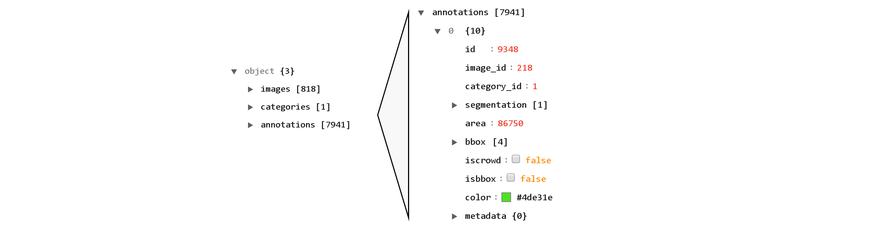

# Algorithmic construct identification in Structural Equation Models (SEM)

## Table of Contents

 
[Arrow Detection](https://git.scc.kit.edu/yn2099/research-model-annotation#arrow-detection)  
[COCO Annotator Data Export](https://git.scc.kit.edu/yn2099/research-model-annotation#coco-annotator-export)  
<a name="arrows"/>

## Data and Scripts Explanation
The following table shows the different scripts and the different output files together with a brief description. Below the table, you will find some graphical output for each of the scripts for further explanation.

| Scripts / Dataset| Explanation|
| --- | --- |
| Arrow Detection Notebook | First try to detect the arrows of the SEMs and also the relations between different constructs. More explained in chapter *Arrow Detection*. |
| detect_constructs.py| Script for detecting constructs within SEMs and drawing them into the image |
| api_calls.py| Script that detects constructs (same method as above) and pushes detected annotations to COCO Annotator using API calls. |
| coco_export.json & annotations_api.json|After annotations is done -> JSON files that are exported from the COCO Annotator. Different export possibilities are available. See [COCO Annotator Data Export](https://git.scc.kit.edu/yn2099/research-model-annotation#coco-annotator-export). |
| annotations_api_to_csv.py & images_mapping_to_csv.py|Simple helper scripts to transform json files to csv files.|
| data_analysis.py|Script for analysing performance of shape detection algorithm and getting insights after labelling.
| detect_construct_names.py|Script for going through final annotated dataset and detecting the names of the constructs in the respective areas using tesseract. Final output is json file that includes information about every annotated construct + the name of the construct that the algorithm detected. Output name: data_tesseract.json|
| create_wordcloud.py| Using data_tesseract.json to create wordcloud of detected construct names.|

###  Detect Constructs
The script runs through all images, detects constructs using cv2's findContours(), and draws them into the images. See below three example outputs.

The outputs show where the algorithm works well (left), where it identifies shapes as constructs that are not constructs (middle), and where it misses out to detect constructs (right).

###  Arrow Detection
The [arrow detection script](https://git.scc.kit.edu/yn2099/research-model-annotation/-/blob/master/Arrow%20Detection.ipynb) shows one possible way on how to extract also information about the relationships between the constructs.

The idea  behind it is as follows:

####  Identifying the arrows between the constructs
In order to identify lines in an image, one can use cv2's [HoughLines function](https://opencv-python-tutroals.readthedocs.io/en/latest/py_tutorials/py_imgproc/py_houghlines/py_houghlines.html). However, without further pre-processing this function would detect all lines that occur within the SEMs, also the lines that represent the edges of the constructs. That's why we first need to delete the detected constructs.

Now we can run HoughLines to idenify the arrows. (left part)
As a next step, we add the shapes back into the image (right part). Now we know, which lines actually represent arrows and which lines are just the edges of the constructs.

Some arrows are detected as multiple lines with a very similar slope. By comparing the slope of all lines and keeping only one per slope, we can clean up the data. Once that is done, we can identify with how many arrows each detected construct intersects.

### API Calls
After the run of the script all detected annoations of the constructs are shown in the COCO annotator dataset.

## COCO Annotator Export
COCO Annotator allows users to export the annotation data in various ways. 
### 1. Export

The simplest way is to just use the export button within the graphical interface. 

You can select which categories of the annotations you want to export. In our case, we only use one category, the constructs. The system generates a json file which can be downloaded within the Export Tab.

The output is a JSON file with the following structure:

It includes information about the images, the categories and the annoations.

### 2. Export

It is also possible to go to COCO's built-in API view, accessible through [ Base URL: /api ], in our case [http://129.13.111.115:5000/api/](http://129.13.111.115:5000/api/).

Since we're mostly interested in the annotations data for our analysis, we focus here on the /annotation/ API.

The output is a JSON file with the following structure.

Please note, that this JSON gives more information about the individual annotations. While the first export only shows annotations that are currently in the dataset, this output also shows annotations that have been deleted already. This way, we can analyse the performance of the construct detection algorithm by comparing the data before and after the manual labelling process. See the analysis script for the results.

